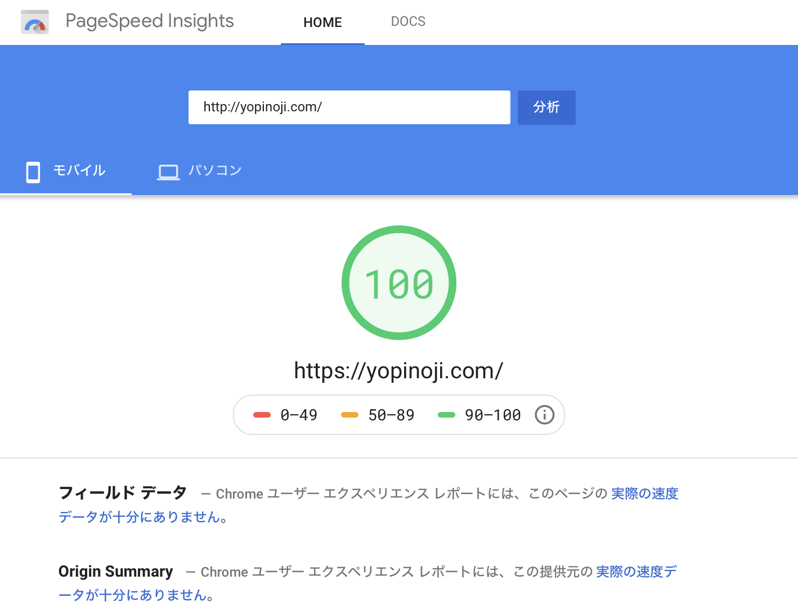

GatbyJSというReact製の静的サイトジェネレーターを使って、ブログを作ってみたのでその話。

##GatsbyJSとは何か

そもそもGatsbyJSって何なのかと言うことについてですが、  
簡単に言うと、HTML/CSS/JavaScriptなどのWebサイトを表示する際に必要な静的サイトを生成してくれるツールです。  
そして、その生成された静的サイトを特定のURLにホスティングすることでWebサイトを作ることができるわけです。  

多くのWebサイト構築に使われているWordPressでは、ページにアクセスがあった際にWebサーバーが処理を行い動的にページを表示しています。  
このようにアクセスした状況に応じて異なる内容のページを表示するWebサイトを動的サイトと呼びます。  
一方でGatsbyJSはWebサイトとして表示可能なファイルを生成します。  
生成されたファイルは動的にデータを読み込むことなどしません。したがって何度開き直しても同じ内容が表示されます。  
こうしたWebサイトを静的サイトと呼びます。

今回自分の作成したブログの構成では、マークダウンで記事を作成してそこからデータを取得するようにし、マークダウンで作られた記事をGitで管理するようにしています。  
静的サイトの配信にはNetlifyを用いており、記事を管理しているGitのリポジトリが更新されるたびに静的サイトを自動で生成して配信するように設定しています。

自分は試していないので詳細は語れないのですが、WordPressで作成した投稿データを用いてGatbyJSで静的サイトを生成することも可能なようです。  
他にも、ContentfulなどのヘッダレスCMSと呼ばれるサービスからのデータ取得にも対応しているようです。  

GatsbyJSでは、サイト表示する部分にReactを使っていたり、書いた記事を取ってくる部分にGraphQLを使っていたりと先進的な作りになってます。  
個人的に、触っていてとても楽しいですし、何より勉強になります。

##なぜGatsbyJSなのか

さて、今回GatsbyJSを使ってブログを作ってみました。  
世の中、ブログを作る方法は色々あると思います。  
無料ブログ作成サイトから作る方法、WordPressで作る方法、ヘッダレスCMSを使う方法など、本当に様々な方法があると思います。  
その中でなぜGatsbyJSなのかについてですが、理由としては下記の3つになります。

- カスタマイズ性が高い
- 低コストで運営できる
- パフォーマンスが良い

上記について、順を追って説明していきます。

###カスタマイズ性が高い

せっかくブログを作るんだから、自分仕様にカスタマイズしたい。  
そんな方も多いと思います。かく言う自分もカスタマイズしたい派の人間です。

細かいカスタマイズが可能なブログを作る際に、一般的によく使われるのがWordPressだと思います。  
ただ、今回GatsbyJSを触った感じでは、WordPressと同等の機能を取り込んだブログを作ることがGatsbyJSにおいても可能ではないかと感じています。

自分が今回ブログを作る際には、以下を満たせるものを作りました。

- 独自ドメインの設定が可能
- デザインのカスタマイズが自由に可能
- 記事をマークダウンで編集可能
- カテゴリーやタグなどの機能追加できる
- 固定ページの作成ができる
- RSSフィード

今回自分がブログ構築した際、GatsbyJSには上記を満たすための機能が揃っていたか、あるいは自分で機能追加することで対応できました。  
カスタマイズ性高いです。

ただ一つだけ壁がありまして、GatsbyJSを使ったサイトをカスタマイズする際には、ReactやGraphQLの知識が必要になります。  
WordPressのようにプラグインのインストールだけで簡単にカスタマイズとはいかないのでハードルが少し高いかもしれません。

裏を返せば、Reactを勉強してる人やReactが書ける人にとっては面白いツールだと思います。  
（ちなみに自分はReact勉強中です。）

###低コストで運営できる

サイト運営で維持費を気にされる方は多いのではないでしょうか。  
お金のかかりそうな項目を考えてみましたが、それなりのサイトを作ろうとすると出費はどうしてもかかるものです。

- 独自ドメインの維持費
- 月々のサーバー料金
- 無料ブログの有料プラン

特にブログを始めたばかりの場合などブログを続けていけるかも分からない状況では、こうした出費をなるべくかけたくないような気がします。  

それではGatsbyJSはどうなのかと言う話ですが、結論から言うと自分の場合は独自ドメインの維持費のみで済んでいます。  
ドメインの維持費は年間で1500円ほどです。月々に換算すると125円ほどです。安いです。  
（ちなみに自分は以前WordPress製のブログをレンタルサーバーで動かしていましたが、その際は月々1500円ほど維持費が必要でした。）

なぜこんなに安いのかと言うと、GatsbyJSで生成した静的サイトをホスティングするだけでいいからです。  
データベースやWebサーバーを用意する必要はありません。  
幸いなことに静的なサイトをホスティングするだけのサービスでは独自ドメインを設定したとしても、大抵は無料の枠組みの中で運用できます。  
つまり、独自のドメインが不要な場合は、無料で運用することも可能です。

自分が把握している範囲のホスティングサービスは以下になります。  
興味があれば検索してみてください。

- Netlify
- Firebase
- GitHub Pages
- Google App Engine
- AWS S3

また、個人サイトの規模だとあまり気にしないかもしれませんが、  
セキュリティという観点において、データベースやWebサーバーが存在しないため、不正アクセスやデータ改ざんをあまり気にする必要がないのは静的サイトの強みですね。

###パフォーマンスが良い

上記の画像は、今回作成したサイトを[Google PageSpeed Insights](https://developers.google.com/speed/pagespeed/insights/)でサイト表示スピードを数値化してみたものです。  
WordPressのサイトの場合、色々と調整しないと高得点が出せなかった記憶があるのですが、GatsbyJS製のサイトでは何も考えずとも100点を出せたのは正直驚きました。

Webサーバーを使う動的なWebサイトでは、ページへのアクセスがあった際に、Webサーバーで処理をしたのちにページを表示しますが、  
GatsbyJSで生成された静的なサイトで構築したWebサイトは、既に生成されてあるファイルを返すだけなので基本的にかなり早いです。

また、生成されたサイトは画像やSEOなどGatsbyJSが最適化してくれているため、  
最適な状態なWebサイトをサクサクと高速で表示できます。

例えば、画像の読み込みにはgatsby-imageというプラグインを使うのですが、  
これを使って読み込むだけで画像サイズ最適化・遅延読み込み・読み込み順の最適化などを行ってくれます。  

また、サイト表示のパフォーマンスとは直接関係ありませんが、GatsbyJS製のサイトの場合はRaectによりシングルページアプリケーション（SPA）として構築されるので、  
ページを遷移する際の移り変りをスムーズに行えてユーザ体験として良いものを提供できるところは好きですね。

##終わりに
今回GatsbyJSを用いてブログを構築してまだ間もないですが、  
GatsbyJSだけで今までWordPressなどで構築していたWebサイトが一部代替できそうなところにとても魅力を感じています。

もちろん、GatsbyJSは万能ではありません。  
静的なサイトに特化しているため、会員登録やログインといった動的な機能を持ったWebサイトの構築には不向きです。

また、静的サイトジェネレーターについては、GatsbyJS以外にも有名なツールがいくつもあるのでそちらについても調べてみると面白いかもしれません。

本記事を読んでGatsbyJSに興味を持たれた方はぜひ公式チュートリアルを読んで試してみてください。

##参考

[GatsbyJS公式](https://www.gatsbyjs.org)

[React用静的サイトジェネレータのGatsbyJsでブログを構築した](https://tsukamon.com/blogs/2)
