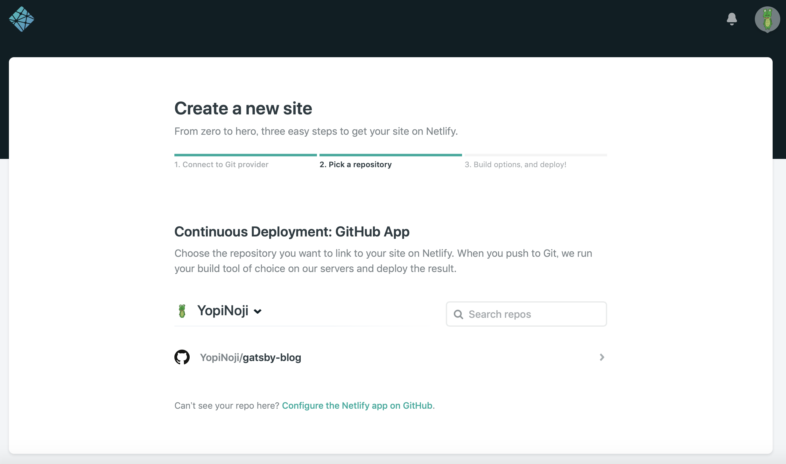
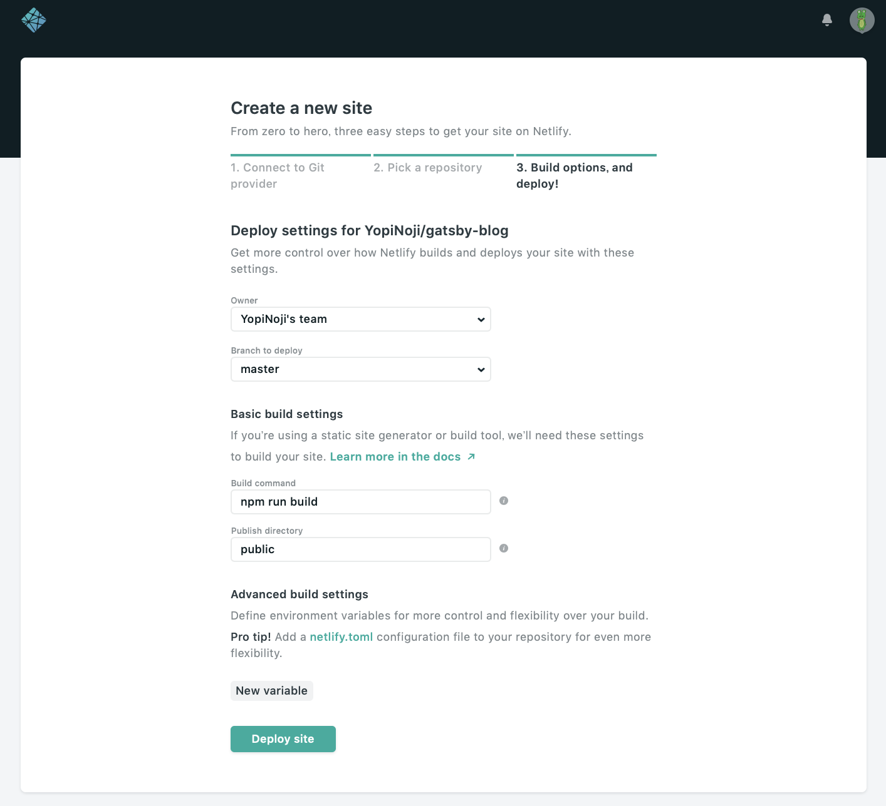
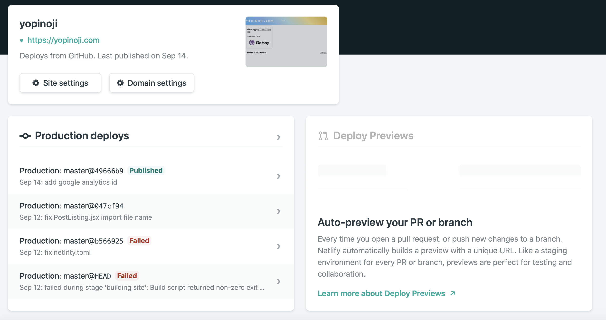

GatbyJSで作ったサイトを公開する際に、使うサービスとして[Netlify](https://www.netlify.com)がおすすめという話です。

実際に当サイトも[Netlify](https://www.netlify.com)を使って公開していますが、とても便利だと感じています。

##Netlifyとは？

静的サイトを配信する環境を提供しているWebサービスです。  
大きな特徴は以下になります。

- GitHubと連携してビルド＆デプロイを自動で行ってくれる
- SSL証明書が無料（独自ドメインをHTTPSで使える）
- デフォルトでCDNによりキャッシュされて高速配信可能（日本にもCDNサーバあるみたい）
- ストレージは100GBまで無料
- データ転送量は月100GBまで無料

何がすごいと言えば、やはりこれだけ色々とできるのに無料で使えるところです。  
有料プランもありますが、個人利用なら無料プランで十分だと思います。

また、他の静的サイトホスティングサービスでは自動ビルド＆デプロイまでしてくれないところが多いので、  
個人的には「GitHubと連携してビルド＆デプロイを自動で行ってくれる」ところがとても便利だと感じています。

##Netlifyの使い方

まず、今回の使い方では、GitHubにソースコードをプッシュするたびに  
Netlifyで最新の状態でビルドしてサイトを配信するという使い方の解説していきます。

そのために、以下のものが必要になります。

- GitHubアカウント
- GitHubで管理しているGatsbyJSのリポジトリ

GitHubの用意できたら、まず[Netlify](https://www.netlify.com)にログインします。  
GitHubアカウントを使ってログインできるので、メールで登録せずにログイン可能です。

ログインできたら、[New site from Git](https://app.netlify.com/start)という項目から新しくサイトを作っていきます。  
この際に、Continuous DeploymentでGitHubを選んでおきましょう。  
GitHubの他にもGitLabやBitbucketといった他のGitリポジトリ管理サービスとの連携も可能です。

次にNetlifyで配信するサイトのGitリポジトリを選択します。  

NetLifyとGitHubを連携しているのにGitHubリポジトリが表示されない場合は、[Configure the Netlify app on GitHub](https://github.com/settings/installations)からGitリポジトリへのアクセス権の設定を確認しましょう。  
個別のリポジトリごとにアクセス許可を出している場合は、上記の画面で表示されないことがあります。

最後にビルドとデプロイの設定です。  
上記の画像の場合、選択したGitリポジトリmasterブランチに更新があった場合に、  
Netlifyは`npm run build`というコマンドを実行し、  
その結果として生成されたpublicフォルダの中身をWeb上にホスティングしてくれます。

また、netlify.tomlというファイルをGitリポジトリに追加することで、  
ビルドする際にカスタム設定を用いることも可能です。
ちなみにnetlify.tomlが既にGitリポジトリに存在する場合は、netlify.tomlの設定内容が優先されてしまうので注意してください。  
（自分はそれが原因でビルドエラーが発生していたことがありました。）

サイトの設定が完了したら、GitHubに更新をプッシュしてみましょう。  
Production deploysのステータスがPublishedになっていれば、無事にビルドとデプロイが完了しています。  
Failedになっている場合は、Netlify上でビルドのログを確認できるのでエラーの箇所を修正する必要があります。

自分の管理画面の画像を見てもらえると分かると思いますが、導入当初はビルドエラーに悩まされました。  
その際の対処方法の記事も書いてありますので、よければ参照してみてください。

##参考

[Netlify公式](https://www.netlify.com)

[NetlifyはGitHubなどからデプロイできる静的Webホスティングサービス](https://tech.qookie.jp/posts/info-netlify-static-web-deploy/)
