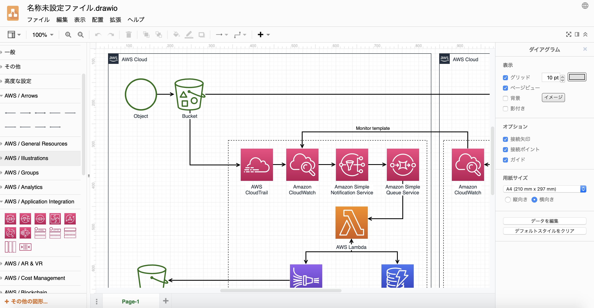
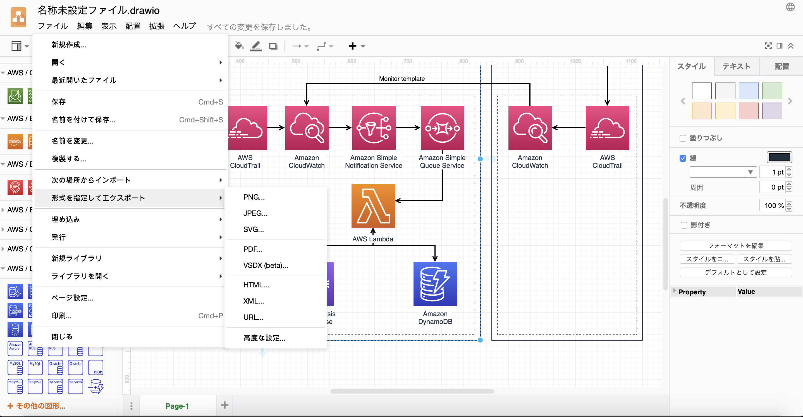
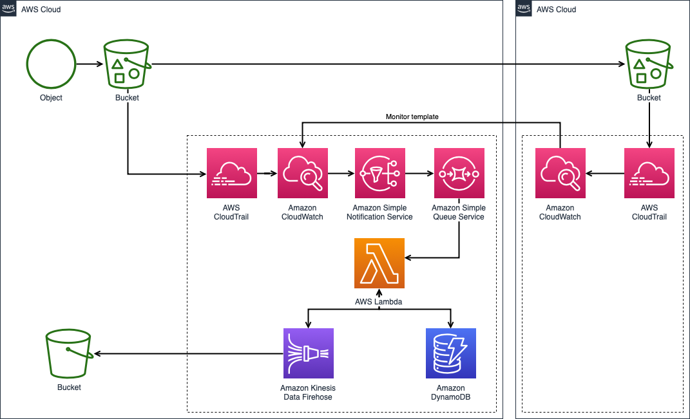

自分はプログラムの設計や仕様を人に説明するときには、図を描くことが多いです。  
説明するときに図やイメージがあると説明しやすいので、図を見せながら説明したいからです。

以前の自分は設計や仕様を伝えるためのフローチャートを作成する際に、ExcelやGoogleスプレッドシートを使って作図していました。  
設計書や仕様書がExcelやGoogleスプレッドシートに書かれていたので、なんとなくExcelやGoogleスプレッドシートで作図もしていたというだけです。

ただ、想像してもらえると分かるかもしれませんが、ExcelやGoogleスプレッドシートはデータ内容や一覧などを示すのには向いていますが作図に特化したツールではないので、  
データの流れを直感的に伝えるための設計資料やフローチャートを作るのに結構手間がかかっていたんですよね。

そんな中で、[draw.io](https://www.draw.io)というWebサービスを知ってからは作図はそちらで行うことが増えたので、その紹介です。

##draw.ioとは？

JGraphというイギリスの会社によって作られた図表のドローイングツールです。  
フローチャートやER図、ネットワーク構成図、フロア図、ベン図など様々な図を描くことができます。

インストール不要でWebブラウザ上から作図することができ、無料で全機能を使うことが可能です。  
作成した図は、端末の他にGoogleドライブやGitHubなどに保存することができます。  
また、AWSやGCP、Azureの各サービスのアイコンを使うことができ、クラウドサービスを使ったサービスの構成図を描くことができます。

draw.io自体はオープンソースになっていて、[JGraph社のGitHub](https://github.com/jgraph/drawio)からソースコードを確認することも可能です。

また、JGraph社のGitHubを見ていて気づいたのですが、Web版だけでなくオフラインでも使えるデスクトップ版もあるようですね。

##draw.ioを実際に使ってみる

何はともあれ[draw.io](https://www.draw.io)を開きます。  
初期表示だと英語で表示されていると思いますが、右下のアイコンから日本語を選ぶことができます。

作ったデータをデバイス（端末）に保存する場合は特に認証や登録は不要ですが、  
GoogleアカウントやMicrosoftアカウントで認証することで、GoogleドライブやOneDriveを保存先として使えるようになります。  
会社でGoogleアカウントを利用している場合は、Googleドライブに保存しておけば他の社員とも共同編集できるので良いと思います。

AWS・GCP・Azureなどのクラウドサービスのアイコンを使ったシステム構成図を描く場合、  
作成する図表のテンプレートを選ぶ画面でCloudを選ぶと、クラウドサービスのアイコンが載ったテンプレートが出てくるのでそれを使いましょう。

他にもTablesというテンプレートの中にはER図の雛形が入っていたり、その他テンプレートの中にはフロア図の雛形が入っていたり、多種多様な図表が描けるようになっています。

今回は例として、クラウドサービスの中では比較的ポピュラーなAWSを使った構成図を作ってみます。

図表の編集画面は上記のような感じです。  
左側のメニューからアイコンを選んで、図表に貼り付けることができます。  
矢印はアイコンとアイコンを結びつけて配置可能です。  
もちろん、テキストも自由に編集可能です。

作成した図表は、再編集可能なファイル形式（.drawio）で保存できます。  
また、PNGやPDF、HTML形式で図表を保存することもできます。  
画像として保存すれば、ExcelやGoogleスプレッドシートなどで管理されている仕様書にも貼り付けることができるので便利です。

そんなこんなでこのような図表を作ることができました。

##参考

[draw.io](https://www.draw.io)

[draw.io公式サイト](https://about.draw.io)

