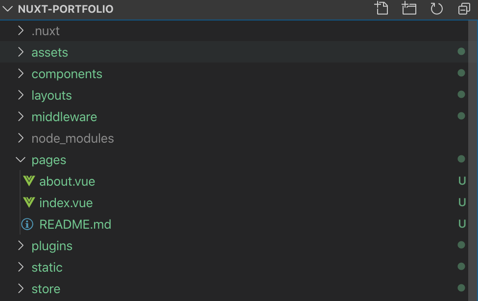
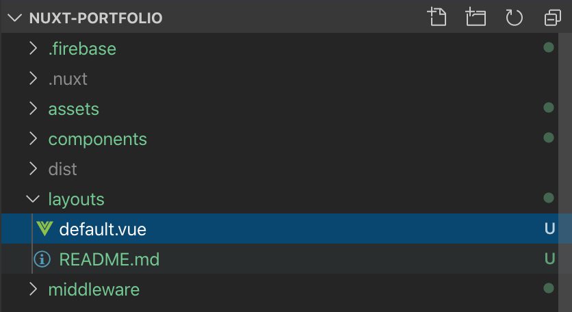

Vue.jsのフレームワークであるNuxt.jsとバックエンドを簡単に用意できるFirebaseというWebサービスを用いて、  
簡単なサイト（ポートフォリオサイト）を作ったことがあったのでその知見です。  

## 何ができるのか

## #Nuxt.jsとは

簡単に説明すると、Vue.jsを使ってアプリケーションを開発する際のめんどくさい部分を予め用意してくれているフレームワークです。  
Vue.js + Vuex(情報の保持) + Vue Router(ルーティング)というVue開発の鉄板構成を簡単に試すことができるので、Vue.jsを勉強中の方にもおすすめできると思います。

動作にはNode.jsが動くサーバが必要ですが、Nuxt.jsで製作したサイトは静的サイトとして生成することも可能なので、  
静的サイトのホスティングサービス（NetlifyやFirebase）を使うことでサーバを用意せずとも簡単にWeb上にサイトを公開することもできます。

他にも、SPAでの問題点を改善するためにサーバサイドレンダリングをサポートしているなど色々と魅力的な機能が備わっています。

### Firebaseとは

Googleが提供しているmobile Backend as a Service（mBaaS）になります。  
簡易的なバックエンドサービスの作成やサイトのホスティングなどをする事ができます。

開発に使える言語は限られてしまいますが（主にNode.jsのみ）、  
スマホやWebアプリ向けのAPIの作成やデータを保存用ののDBなど、サービス作成に必要な基本的な機能はFirebaseを通して実装可能になっています。

個人的には、静的サイトのホスティングだけであればNetlifyを使う方がGitHubと連携してサイトの自動ビルドが可能になるのでおすすめですが、  
今回は「お問い合わせページ」の実装が必要になることを想定して、静的サイトホスティングとお問い合わせ機能のAPI作成が両方対応可能なFirebaseを使おうと思います。

###それで何ができるのか

さて、ここまでNuxt.jsとFirebaseについて簡単に説明してきましたが、  
それらを活用するとWebサーバを用意せずに、ほぼフロントエンドの実装（Vue.js）のみでWebサイトを作成する事ができます。

以下のような方におすすめの構成です。

- 簡単なWebサイト（ポートフォリオやLPなど）を作りたい
- Vue.jsを書ける、または勉強中
- HTMLやCSSに関する知識があり、マークアップができる
- Webサーバにお金をかけたくない
- サーバサイドのプログラムを管理したり書いたりするのはめんどくさい、またはサーバサイドのプログラムは書けない

自分自身はポートフォリオサイトの作成にNuxt.jsとFirebaseを活用しましたが、ドメイン料金（年間1500円ほど）以外は無料で運用できているので満足しています。  
「Vue.jsを用いた簡単なWebサイトを作りたい、だけどお金や手間をできるだけ減らしたい・・・」という方に非常におすすめです。  
なお、今回の自分の例ではアクセス数が少ないサイトのため無料で運用できていますが、Firebaseはアクセス数に応じて課金が必要になりますのでその点は留意する必要があります。

## Nuxt.jsを使ってみる

さて、それでは早速Nuxt.jsを使ってみましょう。  
Nuxt.jsの開発に必要なのは[Node.js](https://nodejs.org/ja/)の実行環境のみです。  
インストールしていない場合はインストールしておきます。  

前準備が整ったら以下のコマンドを実行します。  
なお、今回は`nuxt-portfolio`というプロジェクト名で作成していますが、適宜変更してしまって大丈夫です。

```bash
$ npx create-nuxt-app nuxt-portfolio
```

コマンドを実行するとCUI上で生成するプロジェクトについて幾つか質問されます。  
矢印キー・スペースキー・エンターキーを操作して、どういった内容のプロジェクトを生成するのか選ぶ事ができます。

```bash
✨  Generating Nuxt.js project in nuxt-portfolio
? Project name nuxt-portfolio
? Project description My astounding Nuxt.js project
? Author name 
? Choose the package manager Npm
? Choose UI framework None
? Choose custom server framework None (Recommended)
? Choose Nuxt.js modules Axios
? Choose linting tools ESLint, Prettier
? Choose test framework Jest
? Choose rendering mode Universal (SSR)
? Choose development tools (Press <space> to select, <a> to toggle all, <i> to i
nvert selection)
```

今回は上記のような内容でプロジェクトを作成しました。  
パッケージマネージャーはnpm、UIフレームワークは使わない、ESLint・Prettierはありという感じですね。  
ここでの設定は自分の好きな感じにするといいと思います。

それでは早速作成したプロジェクトを動かしてみましょう。  

```bash
$ cd nuxt-portfolio
$ npm run dev
```


[localhost:3000](http://localhost:3000)にアクセスしてNuxt.jsのページが表示されていればセットアップ完了です。

##Nuxt.jsで作ったサイトにABOUTページを追加してみる

Nuxt.jsの基本的な機能を使ってページを追加してみます。  
Nuxt.jsではルーティング周りの設定が既にされているので、pagesディレクトリ配下にファイルを追加してあげるだけで自動的に新しいページとして認識してくれます。

試しにABOUTページを作成してみます。



ABOUTページを追加するためにすることは、pagesディレクトリに`about.vue`というファイルを追加してあげるだけです。

ファイルの中身は、ひとまず以下のような感じにしておきます。

```javascript
<template>
  <div class="container">
    <nuxt-link to="/">TOP</nuxt-link>
    <div>
      <h1>ABOUT</h1>
      <h2>About Me</h2>
      <li>name:yopi</li>
      <li>age:26</li>
      <li>country:Japan</li>
    </div>
  </div>
</template>

<script>
export default {}
</script>

<style>
.container {
  margin: 0 auto;
  min-height: 100vh;
  display: flex;
  justify-content: center;
  align-items: center;
  text-align: center;
}
</style>
```

`about.vue`を保存した後に[localhost:3000/about](http://localhost:3000/about)にアクセスすると、先ほど作成したページが表示されているはずです。

このように、Nuxt.jsでは簡単にルーティングされたページを追加する事ができます。


## Nuxt.jsで作ったサイトに各ページへのリンク付きメニューを作成する

Webサイトを製作していると、全ページに適用したい共通のメニューを作りたいこともあると思います。  
Nuxt.jsでは、デフォルトでlayoutディレクトリの`default.vue`の内容を全ページに適応してくれます。  
そのため、これを活用して簡単なメニューを作ってみます。



全ページに適応されるメニューを作成するには、layoutディレクトリの`default.vue`にメニューを作成するだけです。  
Nuxt.jsアプリ内のリンクの作成には[nuxt-link](https://ja.nuxtjs.org/api/components-nuxt-link/)というNuxt.jsから用意されているコンポーネントを用います。  
下記を参考にしてください。

```javascript
<template>
  <div>
    <nav>
      <li>
        <nuxt-link to="/">TOP</nuxt-link>
      </li>
      <li>
        <nuxt-link to="/about">ABOUT</nuxt-link>
      </li>
    </nav>
    <nuxt />
  </div>
</template>

<style>
html {
  font-family: 'Source Sans Pro', -apple-system, BlinkMacSystemFont, 'Segoe UI',
    Roboto, 'Helvetica Neue', Arial, sans-serif;
  font-size: 16px;
  word-spacing: 1px;
  -ms-text-size-adjust: 100%;
  -webkit-text-size-adjust: 100%;
  -moz-osx-font-smoothing: grayscale;
  -webkit-font-smoothing: antialiased;
  box-sizing: border-box;
}

*,
*:before,
*:after {
  box-sizing: border-box;
  margin: 0;
}

</style>
```

今回の例では、TOPページとABOUTページへのリンクを貼ったので、これを押すことで各ページへ画面遷移してくれます。

あとはNuxt.jsを使って好きなようにWebサイトを作っていくだけです。  
CSSやJavaScriptで装飾して好きなようにサイトを構築してください。

## Firebaseを使う

さて、サイト製作が終わったら、次にWeb上で公開するためにFirebaseを設定していきましょう。

まず、Firebaseを使うには[Firebase Console](https://console.firebase.google.com)からプロジェクトを作成する必要があります。  
必要になるのは、Googleのアカウントのみです。  
サクッと登録を済ませてプロジェクトを作成しましょう。

プロジェクトを作成したら、先ほどのNuxt.jsに戻ります。  
Firebaseを使えるようにするために、[Firebase CLI](https://firebase.google.com/docs/cli/?hl=ja)をnpmからインストールする必要があります。

[公式のガイド](https://firebase.google.com/docs/cli/?hl=ja)によるとnpmでFirebase CLIをグローバルインストールするのを推奨しているようですが、  
個人的にグローバルで使えるようにPCに色々とインストールするのがあまり好きではないのでローカルインストールで使います。  
（Dockerで開発環境を整える事でPCに直接インストールを避けるという方法もありますが、ここでは解説しません。）

「そもそもnpmのグローバルインストールとかローカルインストールって何？」という方は[こちら](https://qiita.com/heyheyww/items/092fcbc490a249a2d05c)を参照してみてください。

何はともあれ、Firebase CLIをnpmを使ってローカルインストールするために以下を実行します。

```bash
$ npm install --save-dev  firebase-tools
```

インストールが完了したらNuxt.jsプロジェクト配下にFirebase CLIが追加されているはずです。

インストールしたFirebase CLIのコマンドを使えるようにするために、Nuxt.jsプロジェクト配下のpackage.jsonを編集します。  
package.jsonのscripts項目にfirebaseというスクリプトを追加します。  
以下を参考にしてください。

```json
{
  "name": "nuxt-portfolio",
  "version": "1.0.0",
  "description": "My astounding Nuxt.js project",
  "author": "",
  "private": true,
  "scripts": {
    "dev": "nuxt",
    "build": "nuxt build",
    "start": "nuxt start",
    "generate": "nuxt generate",
    "lint": "eslint --ext .js,.vue --ignore-path .gitignore .",
    "test": "jest",
    "firebase": "firebase"
  },
  "dependencies": {
    "nuxt": "^2.0.0",
    "@nuxtjs/axios": "^5.3.6"
  },
  "devDependencies": {
    "@nuxtjs/eslint-config": "^1.0.1",
    "@nuxtjs/eslint-module": "^1.0.0",
    "@vue/test-utils": "^1.0.0-beta.27",
    "babel-eslint": "^10.0.1",
    "babel-jest": "^24.1.0",
    "eslint": "^6.1.0",
    "eslint-config-prettier": "^4.1.0",
    "eslint-plugin-nuxt": ">=0.4.2",
    "eslint-plugin-prettier": "^3.0.1",
    "firebase-tools": "^7.6.2",
    "jest": "^24.1.0",
    "prettier": "^1.16.4",
    "vue-jest": "^4.0.0-0"
  }
}
```

上記の設定をすることで、CUIから`npm run firebase`と入力することで各種Firebase CLIのコマンドを使う事ができるようになります。  
Firebase CLIの下準備ができたら、早速CLIからログインしてみましょう。  
以下を実行する事で認証を行います。

```bash
$ npm run firebase login:ci
```

認証が完了したら、Firebaseを使うための設定ファイルを作成します。  
以下のコマンドを実行する事で、Firebaseを使う上での設定を行う事ができます。

```bash
$ npm run firebase init
```

CUIから色々と選択できますが、今回はひとまずHostingだけを選んで進みます。

```bash

     ######## #### ########  ######## ########     ###     ######  ########
     ##        ##  ##     ## ##       ##     ##  ##   ##  ##       ##
     ######    ##  ########  ######   ########  #########  ######  ######
     ##        ##  ##    ##  ##       ##     ## ##     ##       ## ##
     ##       #### ##     ## ######## ########  ##     ##  ######  ########

You're about to initialize a Firebase project in this directory:

  /Users/yopinoji/Workspace/nuxt-portfolio

? Which Firebase CLI features do you want to set up for this folder? Press Space to select features, then Enter to conf
irm your choices. 
 ◯ Database: Deploy Firebase Realtime Database Rules
 ◯ Firestore: Deploy rules and create indexes for Firestore
 ◯ Functions: Configure and deploy Cloud Functions
❯◉ Hosting: Configure and deploy Firebase Hosting sites
 ◯ Storage: Deploy Cloud Storage security rules

```

プロジェクトは先ほど[Firebase Console](https://console.firebase.google.com)から作成したものを選びます。  
ホスティングを行うディレクトリはdistを入力します。  
以下を参考にしてください。

```bash

=== Project Setup

First, let's associate this project directory with a Firebase project.
You can create multiple project aliases by running firebase use --add, 
but for now we'll just set up a default project.

? Please select an option: Use an existing project
? Select a default Firebase project for this directory: yopinoji-app (YopiNoji-app)
i  Using project yopinoji-app (YopiNoji-app)

=== Hosting Setup

Your public directory is the folder (relative to your project directory) that
will contain Hosting assets to be uploaded with firebase deploy. If you
have a build process for your assets, use your build's output directory.

? What do you want to use as your public directory? dist
? Configure as a single-page app (rewrite all urls to /index.html)? Yes
✔  Wrote dist/index.html

i  Writing configuration info to firebase.json...
i  Writing project information to .firebaserc...

✔  Firebase initialization complete!
```

なお、ここで設定した内容はfirebase.jsonに保存されているので、間違えたとしても設定ファイルを編集するだけで修正できます。

## Nuxt.jsで静的サイトを生成してFirebaseにホスティングする

Nuxt.jsで作成したサイトを静的サイトとして生成してあげます。  
Nuxt.jsが静的サイト生成機能を持っているので、下記を実行するだけでdistディレクトリに静的サイトを生成してくれます。

```bash
$ npm run generate
```

エラー等の問題がなければ、distディレクトリに生成された静的サイトが存在しているはずです。  
それでは生成したサイトをFIrebaseにホスティングすることでWeb上に公開しましょう。

```bash
$ npm run firebase deploy
```

デプロイが開始され、問題なければ最後にホスティング先のURLが表示されます。

```bash
=== Deploying to 'yopinoji-app'...

i  deploying hosting
i  hosting[yopinoji-app]: beginning deploy...
i  hosting[yopinoji-app]: found 11 files in dist
✔  hosting[yopinoji-app]: file upload complete
i  hosting[yopinoji-app]: finalizing version...
✔  hosting[yopinoji-app]: version finalized
i  hosting[yopinoji-app]: releasing new version...
✔  hosting[yopinoji-app]: release complete

✔  Deploy complete!

Hosting URL: https://yopinoji-app.firebaseapp.com
```

アクセスしてみて、Nuxt.jsで作成したサイトが実際に表示されていれば完了です。

## 終わりに

今回、Nuxt.jsで簡単なWebサイトを作成し、それをFirebaseで公開するまでの手順を書いてみましたが、割と簡単に作る事ができました。

他にも、独自ドメインの設定やお問い合わせ機能の実装などもできるので、是非色々と試してみてください。

## 参考

[Nuxt.js　公式](https://ja.nuxtjs.org)

[Firebase　公式](https://firebase.google.com)


