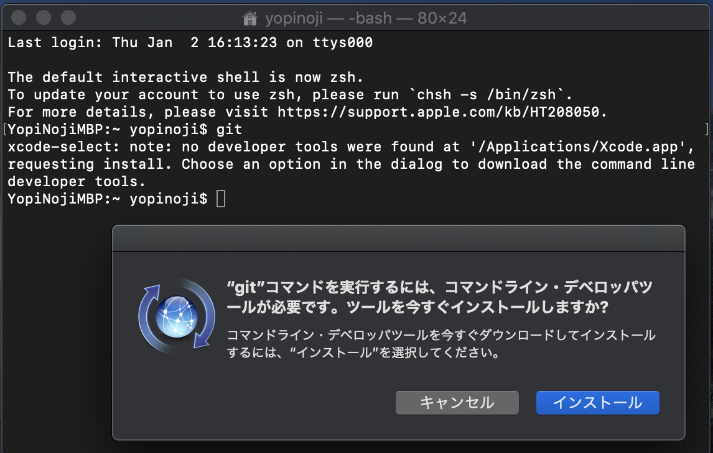
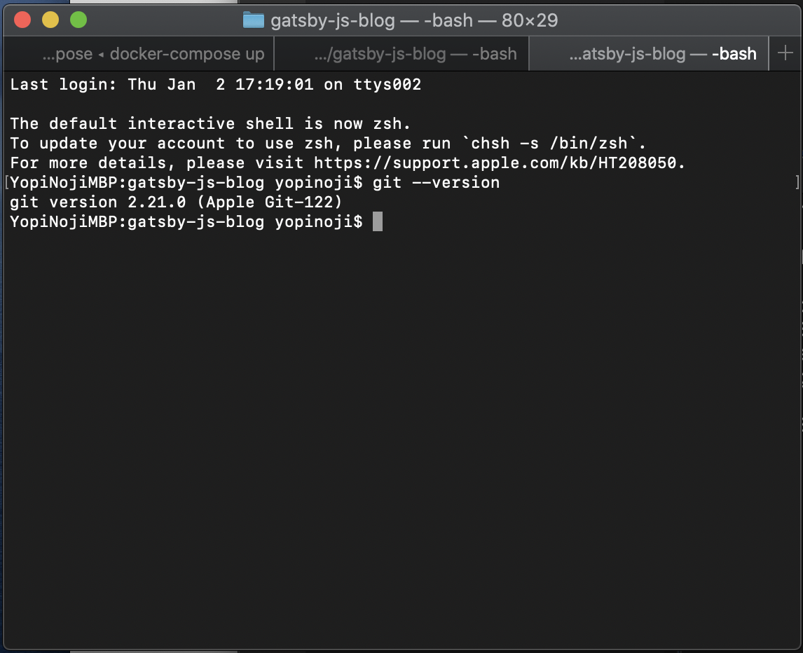

最近、年末年始ということで思い切って PC のクリーンインストールを行い、Git など開発に使うものを全てインストールしなおしました。

Git を Mac にインストールする際に一般的なのは、Mac 用のパッケージ管理ソフト Homebrew を使ってインストールする方法だと思います。  
Google で「Git Mac インストール」と検索してみましたが、Homebrew で Git をインストールする方法の紹介がほとんどでした。

突然ですが、私は自分の PC には不要なソフトは極力インストールしたくない派です。  
Homebrew など、しばらくするとあまり触らなくなるソフトはできるだけインストールしたくない性分です。

そのため、Homebrew 抜きで純粋に Git だけを簡単にインストールする方法を考えたのですが、  
ただ、結果として Homebrew を使った方がいいかもしれないねということに気づいたので、その話です。

## Homebrew 抜きで Mac に Git をインストールする方法

とりあえず、最初に Homebrew 抜きで Git を Mac にインストールする方法を紹介しておきます。  
ただ、この方法でインストールするのかは、最後まで読んでから決めていただければと思います。

とても簡単です。

Mac でターミナルを開いて、`git`と入力します。



Git がインストールされていない場合、コマンドラインデベロッパーツールのインストールを促されます。  
コマンドラインデベロッパーツールは iOS アプリ開発で使う XCode をインストールすると入るツールなのですが、実は XCode 抜きでもいれることができます。



コマンドラインデベロッパーツールのインストールが終わったら、すでに Git コマンドが使えるようになっています。

## 問題点

さて、Homebrew 抜きで Git を使える状態まで持っていくことはできたのですが、  
残念ながら、**このインストール方法には重大な問題点があったのです。**

それは、**Git のバージョンを簡単に変更できないことです。**

バージョン管理に Homebrew を使わないので、当たり前といえば当たり前ですが、  
Git それ自体に脆弱性があった場合など、バージョン変更が容易ではないと少し困ります。

実は、この記事を書いている最近にも Git に脆弱性がありました。  
https://forest.watch.impress.co.jp/docs/news/1223826.html

こういった際に Homebrew を使っていれば、以下のコマンド一行でアップデートできます。

```
brew upgrade
```

Homebrew を使っていない場合、今後のことも考えて Homebrew で Git をインストールしなおすのが賢明ですね。

## 結論

何か問題があった際にすぐにバージョンを切り替えられるのは Homebrew の強みですね。  
やっぱり Git のインストールは Homebrew 使った方がいいですね。

    