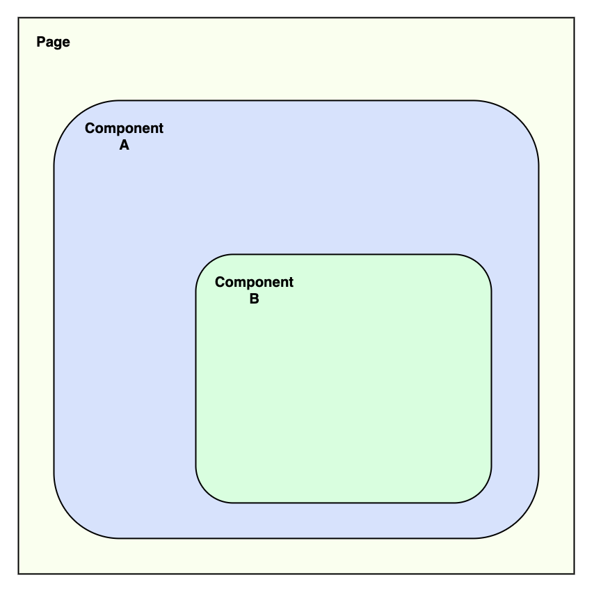

Vue.js ユーザーの皆さん、おはこんばんにちわ。

今回は、Vue.js でモーダルを実装する際の方法について、考察を交えて紹介していきます。  
モーダルと言いましたが、メッセージボックス、ダイアログボックス、スナックバーなどの実装にも同じことが言えます。

まあ、結論から端的に言うと、現時点の Vue.js では [Portal-Vue](https://portal-vue.linusb.org/) を使おうという話になります。

## Portal-Vue is What?

まず最初に、[Portal-Vue](https://portal-vue.linusb.org/) の説明からします。

[Portal-Vue](https://portal-vue.linusb.org/) で、できることは以下の通りです。

- 別々の Vue コンポーネントにおいて、DOM を呼び出すことができる
- 指定した場所に DOM を呼び出せる

DOM で例えるなら、以下のようなことができるイメージです。

```html
<portal to="destination">
  <p>呼び出したい内容</p>
</portal>

<!-- 中略 -->

<portal-target name="destination">
  <!--
    ここに呼び出される
  -->
</portal-target>
```

呼び出したい場所に、呼び出したい DOM を呼び出せる。  
要するに、それができます。

## なぜ Portal-Vue を使ってモーダルを呼び出す方法が良いのか

それでは、なぜ Portal-Vue を使う方法が良いのかを考えていきます。

まず、例としてモーダルを呼び出す際に以下のような構成を想像してほしいです。



大元になるページがあり、そこにコンポーネント A がいて、さらに中にコンポーネント B がいる構成です。  
入れ子構造になってしまっているパターンですね。

スタイルの崩れなどを考慮して、大元になるページ層でモーダルを呼び出すものとします。

こういう場合、コンポーネント B から大元のページのモーダルを呼び出す際の方法は 2 パターン考えられます。

```js
export default {
  methods: {
    event() {
      const val = "メッセージ";
      this.$emit("open-modal", val);
    }
  }
};
```

まず、1 つ目の方法は、上記のように `$emit` でイベントを受け渡していく方法です。  
イベントを受け渡していき、大元のページで受け取ったイベントを使ってモーダルを呼び出すという寸法です。

ただ、今回の例の場合、コンポーネントが入れ子構造になってしまっている都合で、イベントの受け渡しを 2 回行う必要があり、処理がやや冗長です。

入れ子の数が増えた場合、目も当てられないような状況になります。

```js
import { mapActions } from "vuex";
export default {
  methods: {
    ...mapActions("modules/modal", ["setMessage"]),
    event() {
      this.setMessage("メッセージ");
    }
  }
};
```

2 つ目の方法としてあるのが、Vuex です。

コンポーネント B から Vuex に対してメッセージを受け渡し、  
大元のページで Vuex の変更を検知してメッセージを表示する方法ですね。

この方法であれば、入れ子構造になっていたとしても 1 度の情報の受け渡しでモーダルを呼び出すことが確かに可能です。

このように Vuex は便利です。  
ただ、便利に何でも使えるグローバル変数として Vuex を使用することが設計として正しいのかどうかに疑念が残ります。  
（個人的に、ユーザー情報や API から取得した情報の管理だけに Vuex の使用を止めておいた方が良いと考えています）

どのような Vuex 設計が正しいのかについての議論を話すことはここでは避けます。  
（Vuex 自体、もともと便利なグローバル変数として使えてしまう素養があります）

それでは、Vuex の代わりにどうやってモーダルを呼び出せば良いのでしょうか。

```html
<html>
  <portal-target name="destination">
    <!--
      ここに呼び出したい
    -->
  </portal-target>
  <template name="ComponentA">
    <template name="ComponentB">
      <portal to="destination">
        <modal v-if="isOpen">メッセージ</modal>
      </portal>
    </template>
  </template>
</html>
```

そこで、[Portal-Vue](https://portal-vue.linusb.org/) です。

1 度の情報の受け渡しでモーダルを呼び出すことができ、Vuex への依存も排除できます。

どうです？  
[Portal-Vue](https://portal-vue.linusb.org/) を使う理由が理解できたのではないでしょうか。

（もっと良い方法をご存知の方がいたらぜひ教えてください！）

## 最後に

さて、今回の話はここまでです。

ちなみに、この [Portal-Vue](https://portal-vue.linusb.org/) ですが、  
Vue 3.0 からは、[Teleport](https://qiita.com/ryo2132/items/a620755b04294ffabde6) という名称で Vue.js そのものの機能として使えるようです。

どんどん活用していきましょう。
