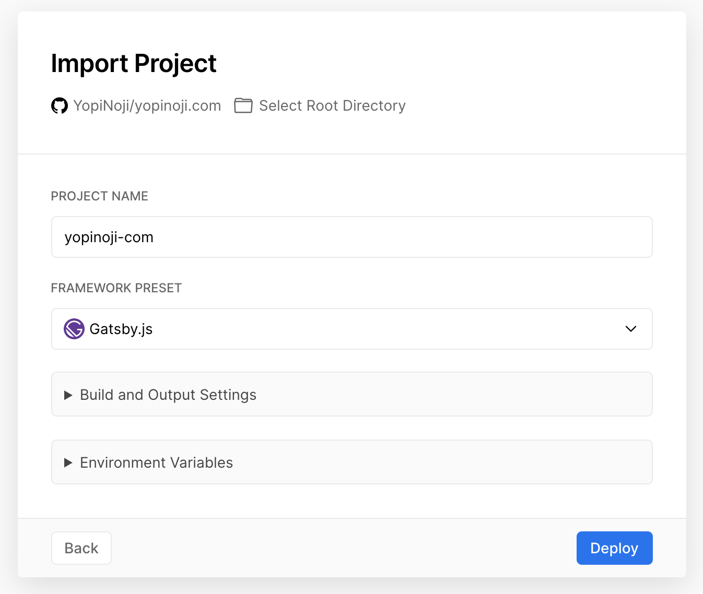
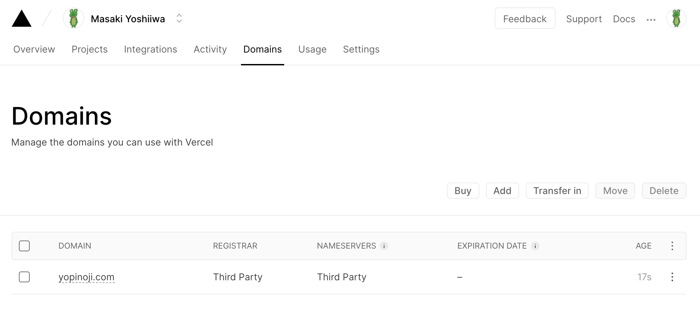

上の画像は 2020 年 10 月現在の当サイトの Google PageSpeed Insight でのスコアです。

一見すると良さそうに見えますが、たまにアクセスするまで時間が少しかかることがあって気になっていました。

原因はおそらくこれです。  
サイトのスコアは満点だったのですが、サーバーの応答速度が遅いと出ていました。

当サイトはサイトの描画に Web サーバを用いておらず、生成した静的サイトをホスティングしているだけの構造、いわゆる [JAMstack](https://jamstack.org/) よりのアーキテクチャを採用しています。

なので応答速度に問題があるとしたらサイトをホスティングしている Netlify の CDN からの応答速度に問題があるのではないかと考えました。

そこでネット上を色々と Netlify に関する情報を調べていきました。  
そしたら、どうやら日本からだと Netlify から応答が返るまでに時間がかかるという情報がいくつか見受けられました。

- [Netlify が日本からだと遅い](https://blog.anatoo.jp/2020-08-03)
- [Netlify の表示スピードがいまいちパフォーマンスを発揮できていない件](https://scrapbox.io/meganii/Netlify%E3%81%AE%E8%A1%A8%E7%A4%BA%E3%82%B9%E3%83%94%E3%83%BC%E3%83%89%E3%81%8C%E3%81%84%E3%81%BE%E3%81%84%E3%81%A1%E3%83%91%E3%83%95%E3%82%A9%E3%83%BC%E3%83%9E%E3%83%B3%E3%82%B9%E3%82%92%E7%99%BA%E6%8F%AE%E3%81%A7%E3%81%8D%E3%81%A6%E3%81%84%E3%81%AA%E3%81%84%E4%BB%B6)

どうやら執筆している現在の Netlify は日本国内に CDN がないため、日本だとレスポンスが返るまで時間がかかってしまう傾向があるようです。

そこでホスティングサービスの移行先を探すことにしました。

## Netlify からの移行先の候補

静的サイトのホスティングサービスとしてすぐに思いついたのは以下でした。

- AWS
- Firebase
- Vercel

AWS は S3 や Cloudfront を使うことで静的サイトの高速配信が可能で、なおかつ業務での使った経験もあったのですが、金銭的な運用コストを考えると真っ先に外れました。

Firebase についても業務での使用経験があり、なおかつ GitHub Actions を用いた自動デプロイ環境の構築をしたことがありました。

ただ、自分が選んだのは Vercel でした。

https://vercel.com/

## Vercel を選んだ理由

Vercel を選んだ理由は以下です。

- AWS を使っていて東京にも CDN のエッジサーバーがあるから
- 趣味で使う範囲なら基本的に無料で使えるから
- サービスを通してユーザー体験をよく考えられているから

まず、日本の東京からもサイトを配信することができるのは大きいなと思いました。

ドキュメントを読むまで知らなかったのですが、内部的には AWS を使っているようです。

https://vercel.com/docs/edge-network/regions

また、GitHub Organizations など組織で使う場合などは料金が発生するようですが、個人の趣味目的なら無料で使えるというのも大きいです。

あとは、試しに使っていて気付いたことですが、サービスとして気が利くというか、ユーザーの体験をよく考えられていることに好感を持ったことも理由のひとつです。

上の画像は例ですが、Vercel は GitHub のプルリクエストごとに個別の環境を自動でデプロイしてくれて、それを通知してくれます。  
なので、プルリクエストによる UI などの変更差分を簡単に確認できます。

他にも、初めてデプロイするまでのフローが分かりやすく体系化されているなど、使っていてストレスをあまり感じなかったです。

そういうところも気に入って Vercel に移行してみることにしました。

## Vercel で独自ドメインを有効にした Gatsby のサイトをデプロイする手順

まず、何はともあれログインしましょう。

https://vercel.com/

GitHub でサイトの構成を管理している場合、GitHub のアカウントでログインしておくと楽です。

あとは案内に従ってサイトをデプロイするだけです。

Gatsby や Next.js を使っているとファイル構成から自動でフレームワークを判別してくれます。

ドメインの設定は以下から行います。

https://vercel.com/dashboard/domains

DNS レコードを設定して繋いであげるだけです。

ネームサーバーの変更に少し時間がかかることがあるので、自分は深夜に行いました。  
（趣味のサイトなので少しくらいアクセスできない時間があってもそれほど問題ないのかもしれない）

## Vercel 移行完了

さて、そんな形で当ブログは Vercel に移行しました。

移行後のレスポンスタイムは改善されているので、しばらく様子見しようかなと思います。
