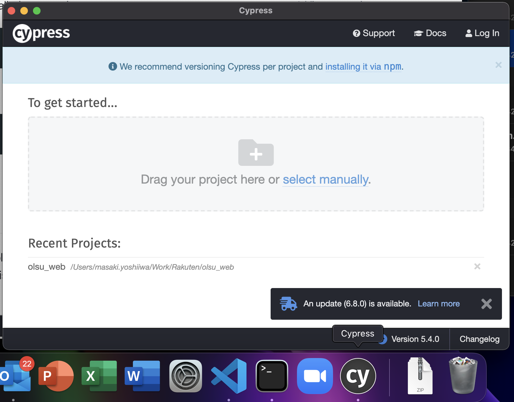
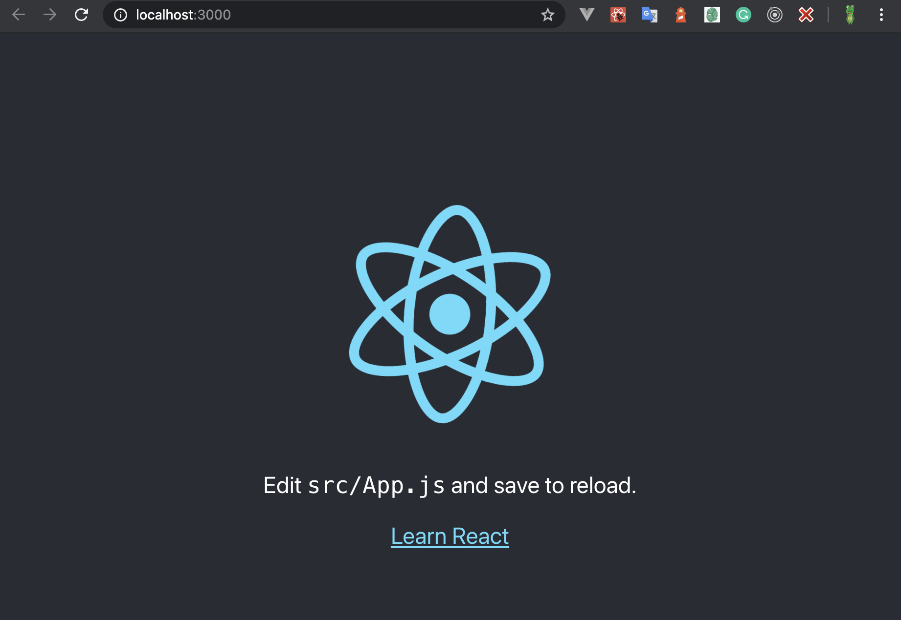
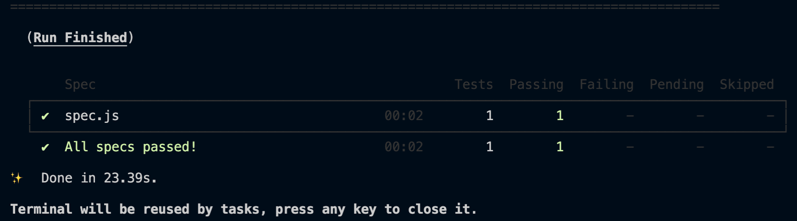
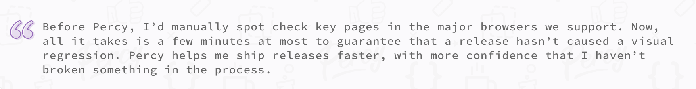
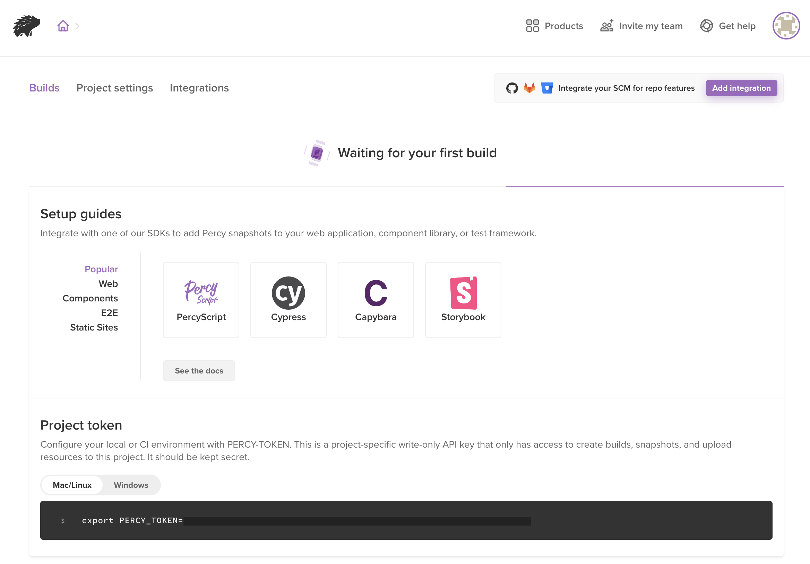
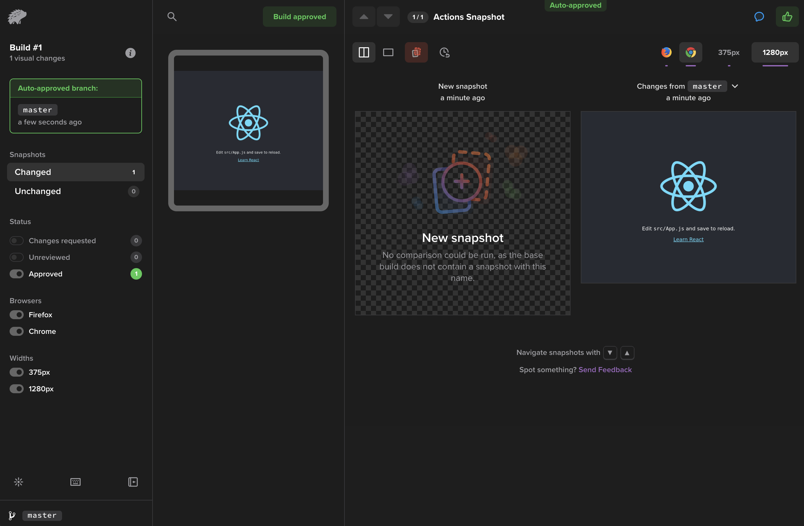

以下を用いて E2E Testing と Visual Regression Testing を行い、CI での自動テストも構築するというのが今回のお題です。

最初に Cypress から、次に Percy と順を追って解説していきます。

## Cypress とは？

ざっくりと説明するなら、「実際のブラウザと同じ機能を用いながらアプリの挙動をテストするためのツール」となると思います。

フロントエンドのテストツールとして、Jest や Selenium などがあります。  
それらと比較して Cypress は開発環境や本番環境をそのままテスト環境として使うことができるので設定がとても簡単です。

また、Jest を使ったテストは実際のブラウザではなく仮想ブラウザ環境で行うという制約がありました。  
しかし、Cypress ではブラウザの機能を使いながらテストが可能なため「ルーティング機能」や「レンダリングされたピクセルの情報」などもブラウザで確認するのと同じようにテスト可能です。

しかも、Jest と同じようにコードベースでテストケースを記述することができ、開発過程からもテストを容易に導入できます。

ただ、Jest でできていた Redux の値をテストするというような単体テストはできません。  
あくまでも、ブラウザを使った E2E Testing がメインになります。

今回は、まず Cypress を React アプリで動かして、CI で自動テストを実行するところから初めてみます。

## React プロジェクトに Cypress による E2E Testing を設定する

ローカル環境でCypressを動かす場合、最初の準備として Cypress をローカル PC にインストールしておきましょう。  
もちろん、Docker などの環境で動かす場合には不要です。

https://docs.cypress.io/guides/getting-started/installing-cypress#Direct-download



今回は [Create React App](https://create-react-app.dev/) で作った React プロジェクトという想定で話を進めていきます。
前提として、Node.js やそのパッケージ管理ツール（yarn, npm）をインストールしておく必要があります。

```
npx create-react-app cyoress-react-sample
cd cyoress-react-sample
yarn install
```

まだ、設定を行うプロジェクトが存在しない場合は、上記のコマンドで簡易的に React のサンプルを作成してしまいましょう。

```
yarn add -D cypress
```

まず、プロジェクトに `cypress` ライブラリをインストールします。

```
npx @bahmutov/cly init
```

次に Cypress の設定ファイルを生成します。
上記のコマンドを実行すると、各種の設定ファイルやサンプルコードが生成されるはずです。

```
cypress.json
cypress
|--README.md
|--fixtures
|--integration
|--plugins
|--screenshots
|--support
|--videos
```

`cypress/integration` の内部には、後ほどテストコードを書いていきます。

また、Cypress を npm scripts で即座に実行できるように、`package.json` に以下のようなスクリプトを追加しておきます。  

```json
{
  "scripts": {
    "start": "react-scripts start",
    "cy:run": "cypress run",
    "cy:open": "cypress open",
  },
}

```

これで `npm run cy:run` または `yarn cy:run` のコマンドで Cypress を実行できるようになります。

また、`cypress.json` にテスト対象のローカル環境の URL を登録しておくと、`cy.visit('/path')`で任意のパスのテストを行うことができて便利です。


```json
{
  "baseUrl": "http://localhost:3000"
}

```

次に、試しに Cypress のテストを 1 件作成してみます。

```ts
// enables intelligent code completion for Cypress commands
// https://on.cypress.io/intelligent-code-completion
/// <reference types="cypress" />

context('Actions', () => {
  beforeEach(() => {
    cy.visit('/')
  })

  it('Test Link Text', () => {
    cy.get('a').contains('Learn React')
  })
})
```

試しに上記のテストコードを `cypress/integration/test.spec.js` に追加してみます。



このテストケースでは、`http://localhost:3000` の a タグ の中に「Learn React」という文字が含まれていることをテストしています。  
[Create React App](https://create-react-app.dev/) で作ったプロジェクトのデフォルト表示が正しいことをテストしています。

Cypress では、他にも色々なメソッドを用いてテストを行うことができます。  
詳しくは以下にあります。  
https://docs.cypress.io/api/table-of-contents

それでは早速テストしてみましょう。

```
yarn start
yarn cy:run
```

上記のコマンドを実行します。
React を `localhost:3000` に立ち上げてから、Cypress を動かします。



テストの結果がコマンドラインに上記のように表示されれば、Cypress の導入は完了です。

## CI/CD のワークフローで Cypress を動かす

さて、Cypress の導入は終わったものの、やはりプロジェクトが更新されるたびにバグやエラーがないことを自動で確認しておきたいですよね。  
そのために CI/CD のワークフローの中で Cypress を動かしてみます。

まず、

```json
{
  "scripts": {
    "start": "react-scripts start",
    "cy:run": "cypress run",
    "cy:run-ci": "npx start-server-and-test start http-get://localhost:3000/ cy:run"
  },
}

```

`cy:run-ci` という npm scripts を追加します。  
このスクリプトを用いることで、`localhost:3000` に React が立ち上がるのを待ってから、Cypress を実行できるようになります。

CI でのテストでは Cypress を実行するために基本的に Docker を用います。
[Cypress 実行用の Docker イメージ](https://hub.docker.com/r/cypress/base)が配布されているのでそれを利用すると良いです。

```
node {
    withDockerContainer(image: 'cypress/base:14', toolName: 'Default') {
        stage('Git Checkout') {
            checkout([$class: 'GitSCM', branches: [[name: '${BRANCH_NAME}']], doGenerateSubmoduleConfigurations: false, userRemoteConfigs: [[credentialsId: 'your_credentials', url: 'https://github.com/your_organization/your_project']]])
        }
        stage('Install Dependencies') {
            sh 'yarn install'
        }
        stage('Cypress') {
            sh 'yarn cy:run-ci'
        }
    }
}

```

さて、それらを `Jenkinsfile` に落とし込むと上記のようになります。
Cypress 用の Docker コンテナで Cypress を実行しています。


## Percy を使い Cypress による画面の変更差分をスナップショットとして取得する

さて、ここまでで E2E Testingを導入し、さらに更新があるたびに自動でテストを動かすところまでできました。

ここは、さらに一歩進んで、画面の変更差分を取得して Web から簡単にできるようにしてみませんか？
デザイナーや PM などの非エンジニア職が画面の変更を確認する際に喜ばれること間違いなしです。

それを実現できるのが、[Percy](https://percy.io/)です。



Percy について詳細な解説はここでは省きますが、簡単に言うと「変更前後で画面の差分を比較することができるサービス」です。  
Visual Regression Testing を簡単に実施するためのツールとして優秀です。  
詳細な解説はインターネットの大海や公式サイトに情報が転がっているのでそちらに任せます。



まず最初に Percy に登録します。
プランによっては月額費用が必要になるので予め確認しておくのが良いでしょう。

登録後、プロジェクトを作成すると Percy がビルド待ちの状態になっているはずです。  
そのため、React プロジェクト側に移動して Percy と連携できるようにします。

Percy との連携方法にはいくつか方法があるのですが、今回は Cypress を既に導入済みなので Cypress で E2E Testingを行いつつ、同時に Percy 用のスナップショットを取得する方法を用います。

以下をプロジェクトにインストールします。

```
yarn add -D @percy/cypress
yarn add -D @percy/cli
```

`@percy/cypress` では Cypress のテストの中で Percy のスナップショットを使えるようにします。
`@percy/cli` では npm scripts で percy コマンドを実行可能にします。

```ts
// enables intelligent code completion for Cypress commands
// https://on.cypress.io/intelligent-code-completion
/// <reference types="cypress" />

context('Actions', () => {
  beforeEach(() => {
    cy.visit('http://localhost:3000/')
  })

  it('Test Link Text', () => {
    cy.get('a').contains('Learn React')
  })

  it('Snapshot', () => {
    cy.percySnapshot()
  })
})
```

続いて、先ほど作成した Cypress のテストケースに Percy のスナップショット取得用の関数を追加します。  
`cy.percySnapshot()` が動いた際に画面のスナップショット（画像）を取得して、Percy に連携してくれます。

また、Percy の関数を動かすために、`cypress/support/index.js` で先ほどインストールした `@percy/cypress` を使えるようにしておく必要があります。

```js
import '@percy/cypress'

```

上記の内容で `cypress/support/commands.js` を作成します。  
ここには Cypress で用いる関数をカスタマイズして定義することができます。

詳細は以下を参照してください。
https://docs.cypress.io/api/cypress-api/custom-commands

```js
import './commands'

```

あとは、コマンドを `cypress/support/index.js` で読み込むだけです。

次は実際にテストを動かし、Percy に連携してみましょう。

```json
{
  "scripts": {
    "cy:run": "cypress run",
    "cy:snapshot": "percy exec -- yarn cy:run",
  },
}

```

テストを動かす前に、`cy.percySnapshot()` などの Percy 関連の関数を使うためには、あらかじめ Percy を立ち上げておく必要があります。  
そのため、上記のように npm scripts を変更します。

実際に動かしてみましょう。

```
export PERCY_TOKEN=***********************
yarn cy:snapshot
```

Percy で作成したプロジェクトからトークンを環境変数に登録してから、`yarn cy:snapshot` コマンドを実行します。



Percy 側に戻ると、Cypress で取得したスナップショットが連携されていることが確認できます。

今回の例ではそもそも変更差分はありませんが、変更差分がある場合は Percy を使い差分をレビューできます。

## 終わりに

ちなみに、今回の実装内容は以下からも確認可能です。  
https://github.com/yopinoji/react-cypress-percy-example