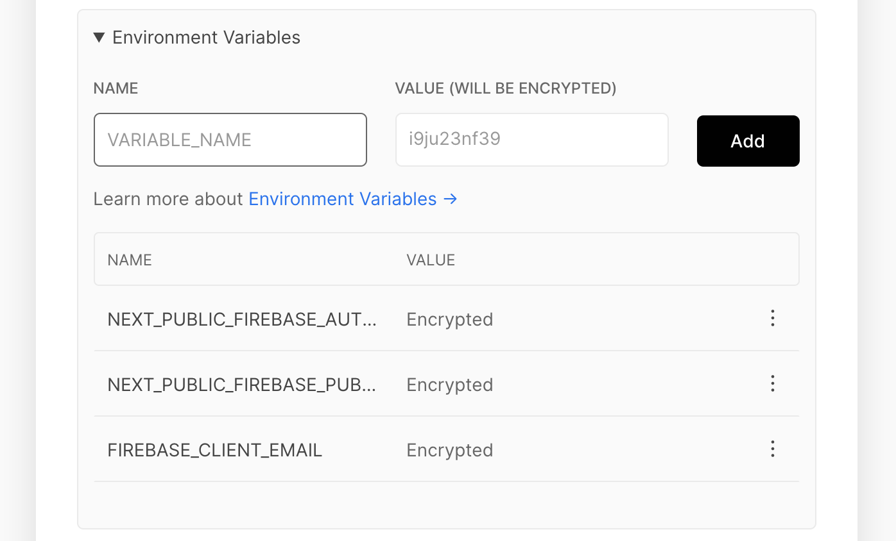
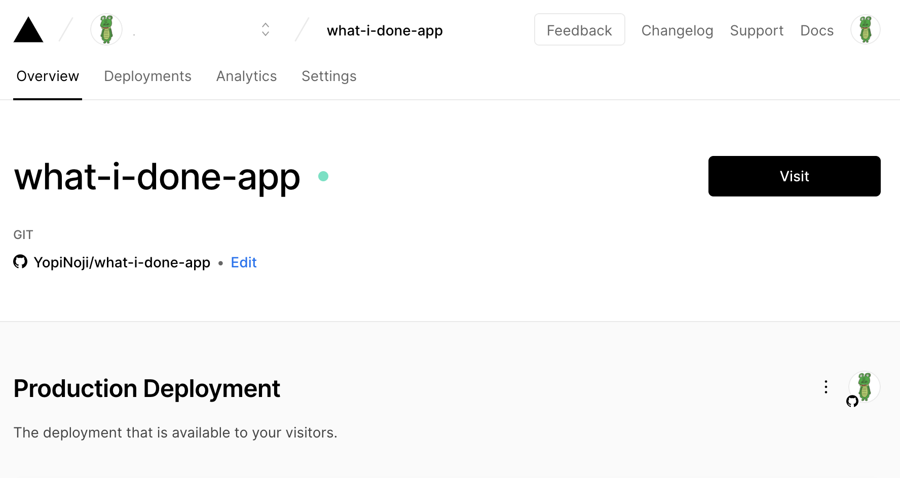

2021 年も始まりまして、新年ということで新しく何かを始めたい気持ちになってくる人もいるかと思います。

自分も新しく Web サービスを個人で作ってみようかなと思いまして、とりあえず Next.js + Firebase で認証機能（ログイン画面）付きの Web サイトを作ってみました。

## なぜ Next.js と Firebase を選んだか

まず、Firebase を選んだ理由は以下になります。

- できるだけお金を節約したかった
- 開発スピード重視で開発したかった
- 以前使ったことがある

AWS Amplify を使うことや自前で VPC サーバーを借りることも考えましたが、初期段階でスピード重視で費用も抑えて開発するとなると Firebase が最良かなと思えました。

続いて、Next.js を選んだ理由は以下になります。

- Vercel と Next.js による SSR を試してみたかった
- Vercel と Next.js によるサーバーレス API を Firebase と組み合わせてみたかった

割と興味本位で試してみたいことが多かったからです。

## 前提

Node.js および Yarn などのツールは以下のバージョンを使用します。

```bash
node -v
v14.14.0

npm -v
6.14.8

yarn -v
1.22.10
```

また、GitHub と Vercel と Google アカウント を使うので、予めアカウントを作成しておくとスムーズです。

## Next.js で Firebase を利用したプロジェクトを始める

さて、それでは早速始めましょう。

Next.js では公式が必要なライブラリや環境に合わせて幾つもテンプレートを用意してくれています。  
今回は `with-firebase-authentication` というテンプレートを活用します。

ちなみに公式テンプレートは以下から全て確認することができます。

https://github.com/vercel/next.js/tree/canary/examples

以下のコマンドで Next.js によるプロジェクトをテンプレートから作成できます。

```bash
npx create-next-app --example with-firebase-authentication your-app
```

テンプレートからプロジェクトを作成できたら、以下のコマンドで開発環境を立ち上げることができます。

```bash
cd your-app
yarn install
yarn dev
```

ただ、この時点では Firebase との連携ができていないので、アプリの動作は不完全なはずです。
Firebase との連携情報を `.env.local` に記述する必要があります。

そのために Firebase でプロジェクトを作成します。

https://console.firebase.google.com/

上記からプロジェクトを作成できます。


プロジェクトを作成できたら、設定画面を開き鍵情報を生成します。

ここから取得できる鍵情報で `.env.local` に記述する必要があるものはほぼ満たせるはずです。


また、Authentication から認証に使用するプロパイダを有効にしておきます。

さて、`.env.local` に必要な情報を満たせたら、再度 `yarn dev` を実行して開発環境を立ち上げます。


立ち上がった開発環境で問題なくログイン画面が開けば OK です。

最後に作成したプロジェクトを GitHub にアップロードしておきましょう。

## Vercel に作成したサイトをデプロイする

さて、ここまでそんなに作業をしていないにも関わらず、認証機能付きの Web サイトが自分のローカル環境で動作するようになりましたね。

最後に実際にオンライン上で確認できるようにデプロイしましょう。

以下から Vercel で新規プロジェクトを作成できます。

https://vercel.com/new

Vercel は、個人で利用する分には基本的に無料で使うことができます。（2021 年 1 月現在の情報）  
Web サイトをホスティングできたり、 API を作成できたり、GitHub のプルリクエストごとにプレビュー環境を作ってくれたりと色々と多機能に使うことができて便利です。


GitHub などと連携して Vercel のアカウントを作成すると、リポジトリからどのフレームワークを使っているかを自動で検知して最適なビルド設定を提案してくれます。

そのため、他の類似サービスと比較しても簡単にデプロイできるはずです。



`.env.local` にある環境変数を上記画像のように設定することができます。

ちなみに、ここで定義した環境変数は Vercel の CLI ツールを利用することで開発環境に持ってくることができます。

```
$ vercel env pull
Vercel CLI 18.0.0
Downloading Development Environment Variables for project my-site
✅ Created .env file [510ms]
```

更に、本番環境・ステージング環境・開発環境など環境ごとに分けて変数を定義することができます。  
とても便利ですね。



最後に Vercel で作成した環境に訪問して、問題なく動作していることを確認してあげましょう。

## 最後に

さて、Vercel + Next.js + Firebase の組み合わせで爆速で認証機能付きの Web サイトを作ってみました。  
ここまでの作業で１時間もかからなかったんじゃないでしょうか。  
更に言えば、ほとんどコードを書いてすらいないですね。

サーバサイドで DB を完全に守るような堅牢な Web アプリケーションを構築するような用途にはまだまだ向いてないかもしれませんが、**ここまで簡単に認証ページ付きの Web サイトが構築できる事実に興奮してしまいます。**

あとは作成したプロジェクトを元に味付けをしていけば Web アプリを作れますね。

それじゃ、また。
